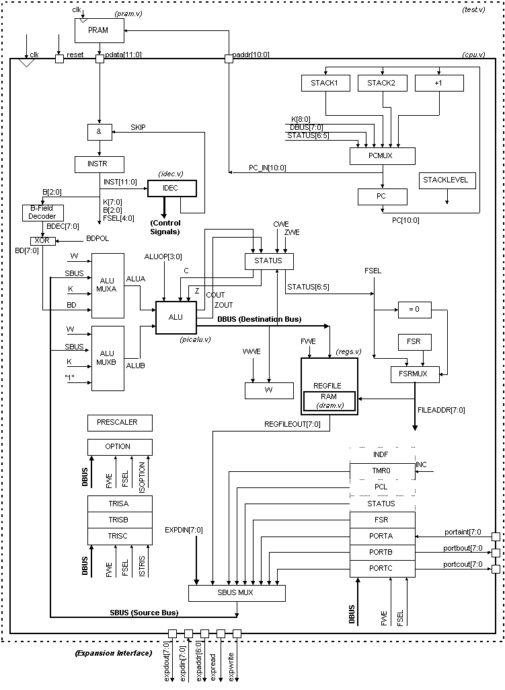
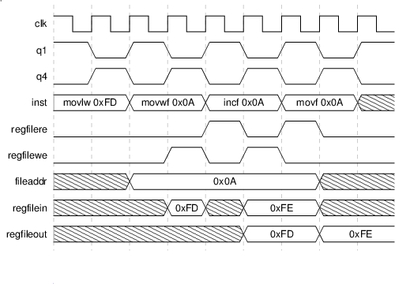
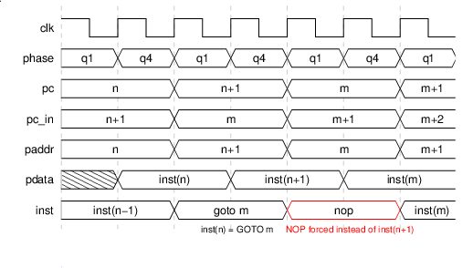
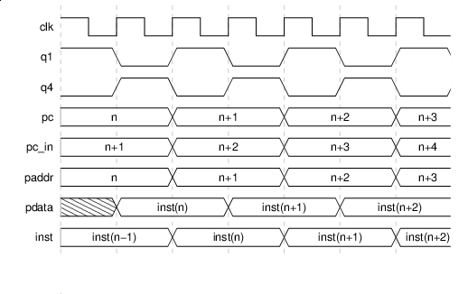

RISC8 Core
==========

*Authorship: Original version of this document, large portions of which are still present, is attributable to Tom Coonan (tcoonan@mindspring.com).*

Table of Contents:

1. Introduction
2. Quick Start
3. System Architecture
4. Compatibility with Microchip 16C57 Devices
5. Module Hierarchy
6. Synthesis
7. CPU Module
8. Memory Interfaces
9. ALU
10. Instruction Decoder
11. Register File
12. Firmware Development
13. Expansion
14. Test Programs
15. Bugs

1 Introduction
--------------

The Free-RISC8 is a Verilog implementation of a simple 8-bit processor.
The RISC8 is binary code compatible with the Microchip 16C57 processor.
Code may be developed and debugged using tools available from a number
of 3rd party tool providers. Programs existing for the 16C57 may be
ported to the RISC8 for use in an FPGA, etc.

The current version is a two-cycle core, meaning that all but branch instructions
take two cycles. One cycle is spent on reading internal registers (*register read*)
and the other cycle is spent on instruction execution (*execute*). Branch instructions
take two instruction cycles (i.e. four clock cycles). If, for whatever reasons, extra
pipelining were needed, it could be easily introduced.

There is presently no pipelining at the instruction level, meaning there
is no overlapping of the *register read* and *execute* phases of subsequent
instructions. It is theoretically possible but would come at the price of higher
complexity.

The current design is synthesizable, but has not been used in any project yet.

### History ###

The legacy version by Tom Coonana was a single-cycle core. The lagcy code is still available
under the *legacy* tag. The major limitation of the legacy architecture was the need of reading
the register file asynchronously, which was due to the need to get instruction operands in the
same cycle the instruction executed. Since the register file is relatively large (seventy 8-bit
words), it would consume a moderate amount of logic and introduce fair combinational delay
on the output multiplexing.

A number of technologies (both FPGA and ASIC) might benefit from using a register file with
a synchronous (i.e. registered) read by using an embedded synchronous RAM rather than building
the register file from discrete flops. The extra cycle needed to get data out of a synchronous
register file introduces the multi-cycle nature of the current core.

<!--
    +--------------------------------------+--------------------------------------+
    | File                                 | Description                          |
    +--------------------------------------+--------------------------------------+
    | test.v                               | Top-level testbench, including the   |
    |                                      | behavioral Verilog program memory    |
    +--------------------------------------+--------------------------------------+
    | cpu.v                                | Top-level synthesizable module.      |
    +--------------------------------------+--------------------------------------+
    | idec.v                               | The Instruction Decoder. This module |
    |                                      | is instanced underneath the cpu      |
    |                                      | module.                              |
    +--------------------------------------+--------------------------------------+
    | alu.v                                | The ALU. This module is instanced    |
    |                                      | underneath the cpu module.           |
    +--------------------------------------+--------------------------------------+
    | regs.v                               | The Register File. This module is    |
    |                                      | instanced underneath the cpu module. |
    +--------------------------------------+--------------------------------------+
    | exp.v                                | Optional Expansion Module. This is   |
    |                                      | an example module that shows how an  |
    |                                      | expansion circuit is added onto the  |
    |                                      | design. The module supplied with     |
    |                                      | this release implements a very       |
    |                                      | simple DDS (Direct Digital           |
    |                                      | Synthesis) circuit that is used for  |
    |                                      | the DDS demo.                        |
    +--------------------------------------+--------------------------------------+
    | dram.v                               | Memory model for Register File       |
    |                                      | ‘D’ata memory (it’s a Synchronous    |
    |                                      | RAM)                                 |
    +--------------------------------------+--------------------------------------+
    | pram.v                               | Memory model for Program Memory      |
    |                                      | ‘P’ata memory (it’s a Synchronous    |
    |                                      | RAM)                                 |
    +--------------------------------------+--------------------------------------+
    | hex2v.c,                             | A C program that translates Intel    |
    |                                      | HEX format data into the Verilog     |
    | hex2v.exe                            | \$readmemh compatible .ROM file.     |
    +--------------------------------------+--------------------------------------+
    | basic.asm, basic.hex,                | The "Basic Confidence" test program  |
    |                                      | which exercises all the              |
    | basic.rom                            | instructions.                        |
    +--------------------------------------+--------------------------------------+
    | dds.asm,                             | A demo that uses the DDS circuit.    |
    |                                      | The demo outputs an FSK "burst".     |
    | dds.hex,                             |                                      |
    |                                      |                                      |
    | dds.rom                              |                                      |
    +--------------------------------------+--------------------------------------+
    | runit                                | A script containing the Verilog      |
    |                                      | command line required.               |
    +--------------------------------------+--------------------------------------+
    | risc8.pdf                            | This file.                           |
    +--------------------------------------+--------------------------------------+
-->

2 Quick Start
-------------

Directory structure is shown on the following figure. The `hdl/verilog/` folder contains
the RTL code of the RISC8 core. Verilog testbench resides in `verif/hdl/verilog/` and
uses `.rom` files located in `verif/other/`.

    <root>
     |
     +-- hdl/verilog
     |    |
     |    +-- cpu.v    Top-level cpu module. Synthesizable.
     |    +-- idec.v   Instruction Decoder. Synthesizable.
     |    +-- alu.v    ALU. Synthesizable.
     |    +-- regs.v   Register File interface. Synthesizable.
     |    `-- dram.v   Memory model, Synchronous 72x8 RAM. Can be synthesizable if a simpler flip-flop memory is desired.
     |
     +-- verif/hdl/verilog
     |    |
     |    +-- test.v   Testbench. Includes the program ROM. NOT synthesizable.
     |    +-- pram.v   Memory model, Synchronous 2048x12 RAM. Can be synthesizable if a simpler flip-flop memory is desired.
     |    `-- exp.v    Example expansion module (a DDS for DDS demo).
     |
     `-- verif/other
          |
          +-- *.asm    Symbolic RISC8 assembly code.
          +-- *.rom    Sample RISC8 binary code in Verilog $readmem format.
          `-- ...      Other supporting files.
          
The use of the files is pretty straightforward and depends on choice of the Verilog
simulator. Here we show an example use of the [Icarus Verilog](http://iverilog.icarus.com):

    # Create and enter the simulation folder
    mkdir sim && cd sim
    
    # Compile the sources (RTL and testbench)
    iverilog -o test -s test  ../hdl/verilog/*.v  ../verif/hdl/verilog/*.v
    
    # Create symlinks to the memory contents files
    ln -s ../verif/other/sindata.hex sindata.hex
    ln -s ../verif/other/basic.rom basic.rom
    
    # Run the simulation
    ./test
    
    # To inspect signal waveforms using GTKwave
    gtkwave -f risc8.vcd

Here is the reference transcipt for that simulation:

    Reading in SIN data for example DDS in EXP.V from sindata.hex
    Free-RISC8.  Version 1.0
    Free-RISC8 1.0.  This is the BASIC CONFIDENCE TEST.
    Loading program memory with basic.rom
    VCD info: dumpfile risc8.vcd opened for output.
    MONITOR_OUTPUT_SIGNATURE: Expected output observed on PORTB: 00
    MONITOR_PORTC: Port C changes to: 00
    MONITOR_PORTB: Port B changes to: 00
    End RESET.
    MONITOR_OUTPUT_SIGNATURE: Expected output observed on PORTB: 01
    MONITOR_PORTB: Port B changes to: 01
    MONITOR_OUTPUT_SIGNATURE: Expected output observed on PORTB: 02
    MONITOR_PORTB: Port B changes to: 02
    MONITOR_OUTPUT_SIGNATURE: Expected output observed on PORTB: 03
    MONITOR_PORTB: Port B changes to: 03
    MONITOR_OUTPUT_SIGNATURE: Expected output observed on PORTB: 04
    MONITOR_PORTB: Port B changes to: 04
    MONITOR_OUTPUT_SIGNATURE: Expected output observed on PORTB: 05
    MONITOR_PORTB: Port B changes to: 05
    MONITOR_OUTPUT_SIGNATURE: Expected output observed on PORTB: 06
    MONITOR_PORTB: Port B changes to: 06
    MONITOR_OUTPUT_SIGNATURE: Expected output observed on PORTB: 07
    MONITOR_PORTB: Port B changes to: 07
    MONITOR_OUTPUT_SIGNATURE: Expected output observed on PORTB: 08
    MONITOR_PORTB: Port B changes to: 08
    Done monitoring for output signature.  9 Matches, 0 Mismatches.
    SUCCESS.
    End of simulation signalled.  Killing simulation in a moment.

3 System Architecture
---------------------

A block diagram of the RISC8 core is shown on the following figure.
Module boundaries are bolded with the Verilog filename indicated.

The core is synchronous with one clock and has one *synchronous* reset. It is scan-insertion friendly.

The RISC8 is a Harvard Architecture and is binary code compatible with
the [Microchip](http://www.microchip.com/) 16C57. Instructions are 12-bits wide and the data path is
8-bits wide. There are up to 72 data words and up to 2048 program words.
It has an accumulator-based instruction set (33 instructions). The *W register*
is the accumulator. The *Program Counter* (PC) and two *Stack registers* allow
two levels of subroutines (this could be easily expanded).

The RISC8 instruction processing has two stages, opernd *Fetch* (`q1`) and instruction *Execute* (`q4`). In the
Fetch stage, the Register file is addressed for reading (by a decoded part of
the instruction) so that operads are ready in the execute stage. The execute
stage is for instruction execution (e.g. ALU operations) and the Register file
may be addressed for write, if the instruction result is to end there.
The core is not really pipelined, meaning that that the `q1` and `q4` stages
do not overlap; they rather act as mutually exclusive clock enables.

<!-- # Register file addressing (timing-gen source, https://sourceforge.net/projects/timing-gen/)
%Conf = ( 
   cycles => 9, 
   right_x => 6000, 
   slew   => 5, 
   slew_offset   => 2, 
   font => 16, # Helvetica 
   name_font => 16, # Helvetica 
  ); 
 
@Waves = ( 
{ type  => clock,
name  => clk
},

{ type => bit, 
name => 'q1', 
change => [[0,1], [1,0], [2,1], [3,0], [4,1], [5,0], [6,1], [7,0], [8,1] ]
}, 
 
{ type => bit, 
name => 'q4',
change => [[0,0], [1,1], [2,0], [3,1], [4,0], [5,1], [6,0], [7,1], [8,0] ]
}, 

{ type  => bus,
name  => 'inst',
change => [ [0,'movlw 0xFD'], [2,'movwf 0x0A'], [4,'incf 0x0A'],  [6,'movf 0x0A'], [8,'-'] ],
},

{ type  => bit,
name  => 'regfilere',
change => [ [0,0], [4,1], [5,0],  [6,1], [7,0] ],
},

{ type  => bit,
name  => 'regfilewe',
change => [ [0,0], [3,1], [4,0],  [5,1], [6,0] ],
},

{ type  => bus,
name  => 'fileaddr',
change => [ [0,'-'], [2,'0x0A'], [8,'-'] ],
},

{ type  => bus,
name  => 'regfilein',
change => [ [0,'-'], [3,'0xFD'], [4,'-'],  [5,'0xFE'], [7,'-'] ],
},

{ type  => bus,
name  => 'regfileout',
change => [ [0,'-'], [5,'0xFD'], [7,'0xFE'] ],
},

{type   => 'bar',
conf   => {line_style => 1, color=>44},
point  => [0..16],
},

); 
1;
-->

Because of the two phases, most instructions take two cycles to complete. Only
the branch instruction, if the branch is taken, take twice that long (i.e. four
cycles).

<!-- # Branch taken (timing-gen source, https://sourceforge.net/projects/timing-gen/)
%Conf = ( 
   cycles => 7, 
   right_x => 6000, 
   slew   => 5, 
   slew_offset   => 2, 
   font => 16, # Helvetica 
   name_font => 16, # Helvetica 
  ); 
 
@Waves = ( 
{ type  => clock,
name  => clk
},

{ type => bus, 
name => 'phase', 
change => [[0,'q1'], [1,'q4'], [2,'q1'], [3,'q4'], [4,'q1'], [5,'q4'], [6,'q1'], [7,'q4'] ]
}, 

{ type  => bus,
name  => 'pc',
change => [ [0,'n'], [2,'n+1'], [4,'m'],  [6,'m+1'] ],
},

{ type  => bus,
name  => 'pc_in',
change => [ [0,'n+1'], [2,'m'], [4,'m+1'],  [6,'m+2'] ],
},

{ type  => bus,
name  => 'paddr',
change => [ [0,'n'], [2,'n+1'], [4,'m'],  [6,'m+1'] ],
},

{ type  => bus,
name  => 'pdata',
change => [ [0,'-'], [1,'inst(n)'], [3,'inst(n+1)'],  [5,'inst(m)'] ],
},

{ type  => bus,
name  => 'inst',
change => [ [0,'inst(n-1)'], [2,'goto m'], [4,'nop',{color=>4}],  [6,'inst(m)'] ],
},

{type   => 'bar',
conf   => {line_style => 1, color=>44},
point  => [0..16],
},

{ type => blank,
conf => {text_y=>-0.4, font=>16, font_size=>8,text_color=>4},
point => ['nop',5],
text => 'NOP forced instead of inst(n+1)',
},

{ type => blank,
conf => {row_y=>-1,text_y=>-0.4, font=>16, font_size=>8},
point => ['goto',3],
text => 'inst(n) = GOTO m',
},
 
); 
1;
-->

The Register File uses a banking scheme and an Indirect Addressing mode. Both
reads and writes are synchronous and hence the Register file can be built from
flip-flops or RAM blocks. As of the current multi-cycle architecture, reads and
writes never occur at the same time.

The Program memory (PRAM) is a separate memory from the Register File and is outside the
core. It can be synchronous or asynchronous. A simple PRAM model is available in the verification code.
Pipelining exists between the core and PRAM, meaning that while one instruction is
being processed (by the core), the next instruction is read by PRAM. The timing is such that
the address of a next instruction is avilable (at the core's output) in the `q1` fetch stage.
The next instruction must be ready in the `q4` execute stage.

<!-- # Instruction processing (timing-gen source, https://sourceforge.net/projects/timing-gen/)
%Conf = ( 
   cycles => 7, 
   right_x => 6000, 
   slew   => 5, 
   slew_offset   => 2, 
   font => 16, # Helvetica 
   name_font => 16, # Helvetica 
  ); 
 
@Waves = ( 
{ type  => clock,
name  => clk
},

{ type => bit, 
name => 'q1', 
change => [[0,1], [1,0], [2,1], [3,0], [4,1], [5,0], [6,1], [7,0] ]
}, 
 
{ type => bit, 
name => 'q4',
change => [[0,0], [1,1], [2,0], [3,1], [4,0], [5,1], [6,0], [7,1] ]
}, 

{ type  => bus,
name  => 'pc',
change => [ [0,'n'], [2,'n+1'], [4,'n+2'],  [6,'n+3'] ],
},

{ type  => bus,
name  => 'pc_in',
change => [ [0,'n+1'], [2,'n+2'], [4,'n+3'],  [6,'n+4'] ],
},

{ type  => bus,
name  => 'paddr',
change => [ [0,'n'], [2,'n+1'], [4,'n+2'],  [6,'n+3'] ],
},

{ type  => bus,
name  => 'pdata',
change => [ [0,'-'], [1,'inst(n)'], [3,'inst(n+1)'],  [5,'inst(n+2)'] ],
},

{ type  => bus,
name  => 'inst',
change => [ [0,'inst(n-1)'], [2,'inst(n)'], [4,'inst(n+1)'],  [6,'inst(n+2)'] ],
},

{type   => 'bar',
conf   => {line_style => 1, color=>44},
point  => [0..16],
},

); 
1; 
-->

The *ALU* is very simple and includes the minimal set of 8-bit operations
(ADD, SUB, OR, AND, XOR, ROTATE, etc.). It is purely combinational.

The *Instruction Decoder* is a purely combinatorial look-up table that supplies key control signals.

The basic 16C57 I/O Ports exist, but full bi-directional control is currently not
supported. It could be implemented if truly desired in a core. Prsently, Port A is
the only input port and Port B and Port C are two output ports.

No interrupts are supported in the 16C5X family and are not offered in
the RISC8. An argument often cited for the lack of interrupts is that the
fast execution and bit test instructions allows for very fast polling,
and therefore reduces the need for interrupts. Lack of interrupts also
simplifies the core's architecture and design.

Little debug is built into the core itself. Off-the-shelf development
environments offer very good debugging capabilities including integrated
Assemblers, simulator and debuggers with breakpoints, etc. Once a rough
cut at the firmware is done in such a tool, then the Verilog simulator
and waveform viewers allow further debugging with the core. The test.v
module provides some limited debugging such as printing out changes to
I/O ports, displaying updates to Register File locations, etc.

The RISC8 core provides an *Expansion interface*. It is a simple synchronous
interface with address, data in and out buses and read and write enable
signals. The expansion interface may be used as a bus; if several expansion
modules are to coexist on this bus, then they must work out their own muxing
scheme to drive `expdin` into the core. See the section on ‘Expansion’ for more
details. An example expansion circuit is in the `exp.v` file in the verification folder.

4 Compatibility with Microchip 16C57 Devices
--------------------------------------------

The RISC8 can execute binary code compatible with the 16C57. Several
flavors of 16C5X exist with different amounts of addressable memory, and
different numbers of I/O pins. The Verilog core can be changed to
correspond with any number of these I/O combinations or memory
combinations.

The following features or characteristic differ:

    +--------------------------+--------------------------+--------------------------+
    | Feature                  | Microchip 16C57          | RISC8                    |
    +--------------------------+--------------------------+--------------------------+
    | Oscillator               | Has several oscillator   | Only has simple, direct  |
    |                          | options.                 | clock input.             |
    +--------------------------+--------------------------+--------------------------+
    | Clocking                 | Internally uses a        | One clock, but 2 stages  |
    |                          | 4-phase clock            | (like 2-phase clock).    |
    +--------------------------+--------------------------+--------------------------+
    | Reset                    | The 16C57 uses an active | Simple active HIGH,      |
    |                          | low MRST and a power-up  | SYNCHRONOUS reset.       |
    |                          | circuit. Some 16C57s     |                          |
    |                          | have brownout.           |                          |
    +--------------------------+--------------------------+--------------------------+
    | Sleep                    | Has sleep instruction    | None. Sleep instruction  |
    |                          | and circuitry.           | will be ignored.         |
    +--------------------------+--------------------------+--------------------------+
    | Tristatable ports        | Has bi-directional ports | No actual tristates on   |
    |                          | with the TRIS            | buffers. Must wire as    |
    |                          | instruction to program   | needed. Currently set up |
    |                          | direction.               | with PORTA as input and  |
    |                          |                          | PORTB and PORTC as       |
    |                          |                          | outputs. The TRIS        |
    |                          |                          | instruction DOES         |
    |                          |                          | actually load a TRISA,   |
    |                          |                          | TRISB and TRISC          |
    |                          |                          | registers, but these     |
    |                          |                          | registers don’t connect  |
    |                          |                          | to anything at this      |
    |                          |                          | time. May be used for    |
    |                          |                          | debug purposes.          |
    +--------------------------+--------------------------+--------------------------+
    | Watchdog Timer           | WDT circuit              | None.                    |
    +--------------------------+--------------------------+--------------------------+
    | Timer0                   | Free-running or external | Only clocked by internal |
    |                          | source                   | clock. Uses the 3        |
    |                          |                          | prescaler bits in OPTION |
    |                          |                          | register.                |
    +--------------------------+--------------------------+--------------------------+
    | OPTION register and      | 16C57 uses it            | Only the bits associated |
    | instruction              |                          | with TIMER0 do anything. |
    +--------------------------+--------------------------+--------------------------+

5 Module Hierarchy
------------------

The hierarchy of the provided Verilog code (RTL+verification) is as follows:

    test.v                  Testbench. Includes the program ROM. NOT synthesizable.
     +-- cpu.v              Top-level cpu module. Synthesizable.
     |    +-- idec.v        Instruction Decoder. Synthesizable.
     |    +-- alu.v         ALU. Synthesizable.
     |    `-- regs.v        Register File interface. Synthesizable.
     |         `-- dram.v   Memory model, Synchronous 72x8 RAM. Can be synthesizable if a simpler flip-flop memory is desired.
     +-- pram.v             Memory model, Synchronous 2048x12 RAM. Can be synthesizable if a simpler flip-flop memory is desired.
     `-- exp.v              Example expansion module (a DDS for DDS demo).

6 Synthesis
-----------

Four core modules (cpu, idec, alu and regs) are directly synthesizable.
Special consideration is required for the two RAMs. The design should be
fully testable using Full Scan, except potentially for the memories.
There are no intentional latches or tristates in the design. The main
clock is the only clock in the design. The main reset line does not go
through any additional gating or logic.

Memories require special consideration. Specific FPGA and ASIC
technologies have specific RAM cells and techniques. The pram.v and
dram.v modules may be thought of as "wrappers" inside of which the
technology specific RAM details are implemented.

The Register File memory is represented in the Verilog lowest-level
module, dram.v. This module is a memory model for a synchronous RAM.
This module is intended as the default behavioral memory model and
includes // synopsys translate\_off directives. The module is
synthesizable, however, should a flip-flop based Register File be
desired. The Register File memory must implement a read/modify/write
behavior. Writes should be registered (synchronous) but reads must be
immediate (asynchronous). This behavior is required due to instructions
that must must read/modify/write file registers within a single
instruction, for example;

    incf 12, f ; This instruction increments the file register at location 12

Many FPGA and ASIC technologies provide this type of memory.

The Program memory may be implemented as a ROM if desired, since it is
not written to by the RISC8. Alternatively, an ASIC or FPGA
implementation may want to implement this as a RAM for booting code.
Small programs could actually be implemented as a logic-based CASE
statement and synthesized. This is left up to the implementor. The
testbench utilizes a simple register array and \$readmemh calls load
this "memory" from the ".rom" file.

7 CPU Module
------------

The CPU module, `cpu.v`, is the top-level RTL module. This is where all
the special registers are implemented such as the INST, W, STACK1,
STACK2 and the PC. Program Flow control is implemented here. All the
internal busses and multiplexors are also implemented here. 
Any special circuitry such as the Timer or custom circuitry
is also implemented in this module.

The RISC8 has 3 major ways it changes program flow: 1) a GOTO
instruction, a 2) CALL subroutine instruction and 3) Conditional SKIP
instructions.

GOTO instructions encode the destination address in the literal field of the
instruction. Subroutines are done in hardware using explicit STACK
registers (versus a software stack and Stack Pointer registers). This is
partly the result of the Harvard architecture and the strict separation
of program and data spaces. SKIP instructions are conditional and
usually involve a bit test on a register.

Whenever a branch is taken, the Fetch/Execute stages must be
"stalled". Normally, the next instruction is always being fetched while
the current instruction is executed. When a branch is taken, then the
upcoming instruction is actually invalid. The RISC8 rectifies this
situation by forcing a NOP instruction into the INST register on the
instruction following a branch. The
NOP instruction is, conveniently, 0x0000. Forcing a NOP instruction is
done by simply anding the output of the INST register with zeros
whenever a branch is detected. The core’s internal `skip` signal is
asserted whenever a branch is detected and the NOP is to be forced.

Another artifact of the pipelining between CPU and PRAM is the reset vector. The
reset vector (the first address fetched and executed) is the last
address in the code space. The PC is loaded, on reset, with the reset
vector (e.g. 0x1FF) and a NOP is forced as the first instruction. In
this way, the first address that is actually Fetched is 0x000 (e.g.
0x1FF + 1) where the program must begin. The core may be reset at any
time by asserting the reset input for at least one clk edge.

8 Memory Interfaces
-------------------

The interface to program memory is straightforward in terms of the core
itself. An 11-bit address is output and a 12-bit data input is expected.
This read is synchronous. A very simple synchronous model of the program
memory (PRAM) is in `pram.v`. The PRAM is not part of the RISC8 core.

The Register File interface is a synchronous interface with clk and
reset inputs. Addressing inputs include a 2-bit **bank** and 5-bit
**location** input. **Read** and **write** enable signals are inputs and
there are two separate 8-bit data busses for input and output. The
`regs.v` module performs the address logic where some words are mirrored
into a common set of addresses.

Beneath `regs.v` is the actual synchronous RAM model in `dram.v`. The
module provided with the core would likely synthesize into flip-flops.
To use a true SRAM, the module needs to be replaced with a wrapper around
a technology IP (ASIC, FPGA) or recoded so that the synthesis tool
infers the memory IP automatically (FPGA).

9 ALU
-----

The ALU is implemented in the `alu.v` file and it is purely
combinational. It has two 8-bit data inputs, A and B as well as a
single-bit CON Carry in input. A 4-bit operand input selects the ALU
operation. It has an 8-bit data output and a single-bit carry output and
also a single-bit zero output.

The ALU does not select the appropriate
source for its inputs nor does it decide when status flags are updated.
This is done at the higher level by the Instruction Decoder and the CPU top
module.

The ALU supports the following operands.
Note that an Add with carry instruction is absent. All RISC8 instructions must use this basic set of supported operations.

    +--------------------------+--------------------------+--------------------------+
    | ALU Operand Select Code  | Operation                | Description              |
    +--------------------------+--------------------------+--------------------------+
    | 0000                     | ADD                      | A + B (The 16C5X does    |
    |                          |                          | NOT add with carry       |
    |                          |                          | input)                   |
    +--------------------------+--------------------------+--------------------------+
    | 1000                     | SUB                      | A - B (The 16C5X does    |
    |                          |                          | NOT subtract with borrow |
    |                          |                          | input)                   |
    +--------------------------+--------------------------+--------------------------+
    | 0001                     | AND                      | A AND B                  |
    +--------------------------+--------------------------+--------------------------+
    | 0010                     | OR                       | A OR B                   |
    +--------------------------+--------------------------+--------------------------+
    | 0011                     | XOR                      | A XOR B                  |
    +--------------------------+--------------------------+--------------------------+
    | 0100                     | COM                      | NOT A                    |
    +--------------------------+--------------------------+--------------------------+
    | 0101                     | ROR                      | {A[0], A[7:1]}           |
    +--------------------------+--------------------------+--------------------------+
    | 0110                     | ROL                      | {A[6:0], A[7]}           |
    +--------------------------+--------------------------+--------------------------+
    | 0111                     | SWAP                     | {A[3:0], A[7:4]}         |
    +--------------------------+--------------------------+--------------------------+

10 Instruction Decoder
----------------------

Instruction Decoding is implemented in the `dec.v` module. It is
purely combinational. It is specifically implemented as a large Verilog
`casex` statement; one or two case clauses per instruction (many
instructions are broken into the d=0 and d=1 cases). Its outputs is a
set of decodes used for various control purposes described below.

An instruction begins to be processed once it is registered into the INST
register. This occurs every `q4` cycle, except when a branch is taken (more
on this later). The RISC8 has 33 instructions. The Instruction in the
INST register is 12-bits wide. Several fields are frequently defined in
instructions, including the F, K and B fields. These subfields are
created in the core from the original 12 INST register bits. The
instruction set summary from the 16C57 data sheet appears in ... ***TBD***

Each instruction implies a particular set of control signals for
controlling, ALU source inputs, PC updating, Status register write
enables, Register File addresses, etc. The Instruction Decoder is
where these control signals get decoded from the instruction. The
result is 15 control outputs.

The Instruction Decoder controls what goes into the ALU and what
operation the ALU performs. The ALU has two input ports; A and B. The A
and B inputs are in turn driven by multiplexors which select from either
W, SBUS, K or the BD vector for ALUA, or from W, SBUS, K or the literal
00000001. Almost all data that will be written back to the register file
goes through the ALU, even if no ALU operation is really needed.
Use of these ALU "tricks" allows us to minimize the
number of buses in the design. For example, to clear a register, the W
register is XORed with itself in order to obtain 00000000. Likewise,
another trick is to OR data with itself in order to simply "copy" the
data through the ALU.

Status flags such as the Z and C bits (Zero and Carry out) are updated
depending on the instruction. For each instruction, an enable signal
must be generated. Likewise, enables for writing to the W and the
Register File must be generated. The following table specifies all the Instruction
Decoder control signals per instruction. This table is similarly
implemented the Instruction Decoder module.

    +---------+---------+---------+---------+---------+---------+---------+---------+---------+---------+
    | Instruc | ALU A   | ALU B   | ALU     | Output  | WWE     | FWE     | ZWE     | CWE     | BDPOL   |
    | tion    | Source  | Source  | Operand | of ALU  |         |         |         |         |         |
    +---------+---------+---------+---------+---------+---------+---------+---------+---------+---------+
    | Byte-Or |         |         |         |         |         |         |         |         |         |
    | iented  |         |         |         |         |         |         |         |         |         |
    | File    |         |         |         |         |         |         |         |         |         |
    | Registe |         |         |         |         |         |         |         |         |         |
    | r       |         |         |         |         |         |         |         |         |         |
    | Operati |         |         |         |         |         |         |         |         |         |
    | ons     |         |         |         |         |         |         |         |         |         |
    +---------+---------+---------+---------+---------+---------+---------+---------+---------+---------+
    | NOP     | X       | X       | X       | X       | 0       | 0       | 0       | 0       | 0       |
    +---------+---------+---------+---------+---------+---------+---------+---------+---------+---------+
    | MOVWF   | W       | W       | OR      | W       | 0       | 1       | 0       | 0       | 0       |
    +---------+---------+---------+---------+---------+---------+---------+---------+---------+---------+
    | CLRW    | W       | W       | XOR     | 0       | 1       | 0       | 1       | 0       | 0       |
    +---------+---------+---------+---------+---------+---------+---------+---------+---------+---------+
    | CLRF    | W       | W       | XOR     | 0       | 0       | 1       | 1       | 0       | 0       |
    +---------+---------+---------+---------+---------+---------+---------+---------+---------+---------+
    | SUBWF   | F       | W       | SUB     | F - W   | 1       | 0       | 1       | 1       | 0       |
    | (d=0)   |         |         |         |         |         |         |         |         |         |
    +---------+---------+---------+---------+---------+---------+---------+---------+---------+---------+
    | SUBWF   | F       | W       | SUB     | F - W   | 0       | 1       | 1       | 1       | 0       |
    | (d=1)   |         |         |         |         |         |         |         |         |         |
    +---------+---------+---------+---------+---------+---------+---------+---------+---------+---------+
    | DECF    | F       | 1       | SUB     | F - 1   | 1       | 0       | 1       | 0       | 0       |
    | (d=0)   |         |         |         |         |         |         |         |         |         |
    +---------+---------+---------+---------+---------+---------+---------+---------+---------+---------+
    | DECF(d= | F       | 1       | SUB     | F - 1   | 0       | 1       | 1       | 0       | 0       |
    | 1)      |         |         |         |         |         |         |         |         |         |
    +---------+---------+---------+---------+---------+---------+---------+---------+---------+---------+
    | IORWF   | W       | F       | OR      | W | F   | 1       | 0       | 1       | 0       | 0       |
    | (d=0)   |         |         |         |         |         |         |         |         |         |
    +---------+---------+---------+---------+---------+---------+---------+---------+---------+---------+
    | IORWF(d | W       | F       | OR      | W | F   | 0       | 1       | 1       | 0       | 0       |
    | =1)     |         |         |         |         |         |         |         |         |         |
    +---------+---------+---------+---------+---------+---------+---------+---------+---------+---------+
    | ANDWF   | W       | F       | AND     | W & F   | 1       | 0       | 1       | 0       | 0       |
    | (d=0)   |         |         |         |         |         |         |         |         |         |
    +---------+---------+---------+---------+---------+---------+---------+---------+---------+---------+
    | ANDWF(d | W       | F       | AND     | W & F   | 0       | 1       | 1       | 0       | 0       |
    | =1)     |         |         |         |         |         |         |         |         |         |
    +---------+---------+---------+---------+---------+---------+---------+---------+---------+---------+
    | XORWF   | W       | F       | XOR     | W \^ F  | 1       | 0       | 1       | 0       | 0       |
    | (d=0)   |         |         |         |         |         |         |         |         |         |
    +---------+---------+---------+---------+---------+---------+---------+---------+---------+---------+
    | XORWF(d | W       | F       | XOR     | W \^ F  | 0       | 1       | 1       | 0       | 0       |
    | =1)     |         |         |         |         |         |         |         |         |         |
    +---------+---------+---------+---------+---------+---------+---------+---------+---------+---------+
    | ADDWF   | W       | F       | ADD     | W + F   | 1       | 0       | 1       | 1       | 0       |
    | (d=0)   |         |         |         |         |         |         |         |         |         |
    +---------+---------+---------+---------+---------+---------+---------+---------+---------+---------+
    | ADDWF(d | W       | F       | ADD     | W + F   | 0       | 1       | 1       | 1       | 0       |
    | =1)     |         |         |         |         |         |         |         |         |         |
    +---------+---------+---------+---------+---------+---------+---------+---------+---------+---------+
    | MOVF    | F       | F       | OR      | F       | 1       | 0       | 1       | 0       | 0       |
    | (d=0)   |         |         |         |         |         |         |         |         |         |
    +---------+---------+---------+---------+---------+---------+---------+---------+---------+---------+
    | MOVF(d= | F       | F       | OR      | F       | 0       | 1       | 1       | 0       | 0       |
    | 1)      |         |         |         |         |         |         |         |         |         |
    +---------+---------+---------+---------+---------+---------+---------+---------+---------+---------+
    | COMF    | F       | X       | NOT     | \~F     | 1       | 0       | 1       | 0       | 0       |
    | (d=0)   |         |         |         |         |         |         |         |         |         |
    +---------+---------+---------+---------+---------+---------+---------+---------+---------+---------+
    | COMF(d= | F       | X       | NOT     | \~F     | 0       | 1       | 1       | 0       | 0       |
    | 1)      |         |         |         |         |         |         |         |         |         |
    +---------+---------+---------+---------+---------+---------+---------+---------+---------+---------+
    | INCF    | F       | 1       | ADD     | F + 1   | 1       | 0       | 1       | 0       | 0       |
    | (d=0)   |         |         |         |         |         |         |         |         |         |
    +---------+---------+---------+---------+---------+---------+---------+---------+---------+---------+
    | INCF(d= | F       | 1       | ADD     | F + 1   | 0       | 1       | 1       | 0       | 0       |
    | 1)      |         |         |         |         |         |         |         |         |         |
    +---------+---------+---------+---------+---------+---------+---------+---------+---------+---------+
    | DECFSZ  | F       | 1       | SUB     | F - 1   | 1       | 0       | 0       | 0       | 0       |
    | (d=0)   |         |         |         |         |         |         |         |         |         |
    +---------+---------+---------+---------+---------+---------+---------+---------+---------+---------+
    | DECFSZ( | F       | 1       | SUB     | F - 1   | 0       | 1       | 0       | 0       | 0       |
    | d=1)    |         |         |         |         |         |         |         |         |         |
    +---------+---------+---------+---------+---------+---------+---------+---------+---------+---------+
    | RRF     | F       | X       | ROR     | {C,     | 1       | 0       | 0       | 1       | 0       |
    | (d=0)   |         |         |         | F[7:1]} |         |         |         |         |         |
    +---------+---------+---------+---------+---------+---------+---------+---------+---------+---------+
    | RRF(d=1 | F       | X       | ROR     | {C,     | 0       | 1       | 0       | 1       | 0       |
    | )       |         |         |         | F[7:1]} |         |         |         |         |         |
    +---------+---------+---------+---------+---------+---------+---------+---------+---------+---------+
    | RLF     | F       | X       | ROL     | {F[6:0] | 1       | 0       | 0       | 1       | 0       |
    | (d=0)   |         |         |         | ,       |         |         |         |         |         |
    |         |         |         |         | C}      |         |         |         |         |         |
    +---------+---------+---------+---------+---------+---------+---------+---------+---------+---------+
    | RLF(d=1 | F       | X       | ROL     | {F[6:0] | 0       | 1       | 0       | 1       | 0       |
    | )       |         |         |         | ,       |         |         |         |         |         |
    |         |         |         |         | C}      |         |         |         |         |         |
    +---------+---------+---------+---------+---------+---------+---------+---------+---------+---------+
    | SWAPF   | F       | X       | SWAP    | {F[3:0] | 1       | 0       | 0       | 0       | 0       |
    | (d=0)   |         |         |         | ,       |         |         |         |         |         |
    |         |         |         |         | F[7:4]} |         |         |         |         |         |
    +---------+---------+---------+---------+---------+---------+---------+---------+---------+---------+
    | SWAPF(d | F       | X       | SWAP    | {F[3:0] | 0       | 1       | 0       | 0       | 0       |
    | =1)     |         |         |         | ,       |         |         |         |         |         |
    |         |         |         |         | F[7:4]} |         |         |         |         |         |
    +---------+---------+---------+---------+---------+---------+---------+---------+---------+---------+
    | INCFSZ  | F       | 1       | ADD     | F + 1   | 1       | 0       | 0       | 0       | 0       |
    | (d=0)   |         |         |         |         |         |         |         |         |         |
    +---------+---------+---------+---------+---------+---------+---------+---------+---------+---------+
    | INCFSZ  | F       | 1       | ADD     | F + 1   | 0       | 1       | 0       | 0       | 0       |
    | (d=1)   |         |         |         |         |         |         |         |         |         |
    +---------+---------+---------+---------+---------+---------+---------+---------+---------+---------+
    | Bit-Ori |         |         |         |         |         |         |         |         |         |
    | ented   |         |         |         |         |         |         |         |         |         |
    | File    |         |         |         |         |         |         |         |         |         |
    | Registe |         |         |         |         |         |         |         |         |         |
    | r       |         |         |         |         |         |         |         |         |         |
    | Operati |         |         |         |         |         |         |         |         |         |
    | ons     |         |         |         |         |         |         |         |         |         |
    +---------+---------+---------+---------+---------+---------+---------+---------+---------+---------+
    | BCF     | F       | K       | BCLR    | F &     | 0       | 1       | 0       | 0       | 1       |
    |         |         |         |         | (\~(1   |         |         |         |         |         |
    |         |         |         |         | \<\<    |         |         |         |         |         |
    |         |         |         |         | K))     |         |         |         |         |         |
    +---------+---------+---------+---------+---------+---------+---------+---------+---------+---------+
    | BSF     | F       | K       | BSET    | F |     | 0       | 1       | 0       | 0       | 0       |
    |         |         |         |         | \~(1    |         |         |         |         |         |
    |         |         |         |         | \<\< K) |         |         |         |         |         |
    +---------+---------+---------+---------+---------+---------+---------+---------+---------+---------+
    | BTFSC   | F       | K       | BTST    | F & (1  | 0       | 0       | 0       | 0       | 0       |
    |         |         |         |         | \<\< K) |         |         |         |         |         |
    +---------+---------+---------+---------+---------+---------+---------+---------+---------+---------+
    | BTFSS   | F       | K       | BTST    | F & (1  | 0       | 0       | 0       | 0       | 0       |
    |         |         |         |         | \<\< K) |         |         |         |         |         |
    +---------+---------+---------+---------+---------+---------+---------+---------+---------+---------+
    | Literal |         |         |         |         |         |         |         |         |         |
    | and     |         |         |         |         |         |         |         |         |         |
    | Control |         |         |         |         |         |         |         |         |         |
    | Operati |         |         |         |         |         |         |         |         |         |
    | ons     |         |         |         |         |         |         |         |         |         |
    +---------+---------+---------+---------+---------+---------+---------+---------+---------+---------+
    | OPTION  | W       | W       | OR      | W       | 0       | 1       | 0       | 0       | 0       |
    +---------+---------+---------+---------+---------+---------+---------+---------+---------+---------+
    | SLEEP   | X       | X       | X       | X       | 0       | 0       | 0       | 0       | 0       |
    +---------+---------+---------+---------+---------+---------+---------+---------+---------+---------+
    | CLRWDT  | X       | X       | X       | X       | 0       | 0       | 0       | 0       | 0       |
    +---------+---------+---------+---------+---------+---------+---------+---------+---------+---------+
    | TRIS    | W       | W       | OR      | W       | 0       | 1       | 0       | 0       | 0       |
    +---------+---------+---------+---------+---------+---------+---------+---------+---------+---------+
    | RETLW   | K       | K       | OR      | K       | 0       | 0       | 0       | 0       | 0       |
    +---------+---------+---------+---------+---------+---------+---------+---------+---------+---------+
    | CALL    | X       | X       | X       | X       | 0       | 0       | 0       | 0       | 0       |
    +---------+---------+---------+---------+---------+---------+---------+---------+---------+---------+
    | GOTO    | X       | X       | X       | X       | 0       | 0       | 0       | 0       | 0       |
    +---------+---------+---------+---------+---------+---------+---------+---------+---------+---------+
    | MOVLW   | K       | K       | OR      | K       | 1       | 0       | 0       | 0       | 0       |
    +---------+---------+---------+---------+---------+---------+---------+---------+---------+---------+
    | IORLW   | W       | K       | OR      | K | W   | 1       | 0       | 1       | 0       | 0       |
    +---------+---------+---------+---------+---------+---------+---------+---------+---------+---------+
    | ANDLW   | W       | K       | AND     | K & W   | 1       | 0       | 1       | 0       | 0       |
    +---------+---------+---------+---------+---------+---------+---------+---------+---------+---------+
    | XORLW   | W       | K       | XOR     | K \^ W  | 1       | 0       | 1       | 0       | 0       |
    +---------+---------+---------+---------+---------+---------+---------+---------+---------+---------+

11 Register File
----------------

The Register File is implemented in the Verilog file regs.v. The
Register File is somewhat more complicated than the program code memory.
The program memory is outside the core, and is implemented as a simple
memory. The Register File requires an input write port and an output
read port. It is also partitioned into several "banks". These banks are
sometimes mapped into one common set of memory words. It is also
desirable to "nullify" particular locations which are used for custom
peripherals (so as to not waste silicon). The module dreg.v contains all
the logic that maps register addresses (which includes banks and
offsets) to physical RAM addresses. Beneath this module is the generic
memory model (dram.v). Table 6. shows ...

<!--
File Register

Final RAM Address

Description

FSR[6:5]

f[4:0]

00

0x00 – 0x07

N/A

Special Purpose Registers (8)

00

0x08 – 0x0F

0x00 – 0x07

Common Registers (8)

00

0x10 – 0x1F

0x08 – 0x17

Bank \#0 Registers (16)

01

0x00 – 0x07

N/A

Special Purpose Registers (8 mirrored)

01

0x08 – 0x0F

0x00 – 0x07

Common Registers (8 mirrored)

01

0x10 – 0x1F

0x18 – 0x2F

Bank \#1 Registers (16)

10

0x00 – 0x07

N/A

Special Purpose Registers (8 mirrored)

10

0x08 – 0x0F

0x00 – 0x07

Common Registers (8 mirrored)

10

0x10 – 0x1F

0x30 – 0x47

Bank \#2 Registers (16 mirrored)

11

0x00 – 0x07

N/A

Special Purpose Registers (8 mirrored)

11

0x08 – 0x0F

0x00 – 0x07

Common Registers (8 mirrored)

11

0x10 – 0x1F

0x48 – 0x5F

Bank \#3 Registers (16 mirrored)
-->
 

At this time, the Register File contains 70 8-bit data words. The 16C57
has 72 registers. The core has 70 registers available because, at this
time, there are 2 locations used for a custom peripheral. As peripherals
are added in this way, locations must be taken from the memory space.

The 16C57 devices use a 4-phase clock derived from a external crystal.
The RISC8 uses a single clock input and derives a 4 phase synchronous
clock. When considering using memory hard cells, this clocking must be
considered carefully. The original 16C57 utilized different clock phases
to accomplish a Register File read followed by write operation.
Likewise, the core uses these phases in order to perform a read and a
write within a single instruction "cycle". A Register File location must
be readable and writeable during one instruction cycle (e.g.
Read/Modify/Write) as described earlier in the Synthesis section.

12 Firmware Development
-----------------------

An advantage to using the RISC8 over a purely home-brew processor is the
wealth of existing development tools. Development is typically done both
on the PC and on UNIX. Existing code development tools used to develop
code for the 16C57 may be used for the RISC8. It is assumed that the
development of working code should be done in one of the many
C compiler/assembler/debugger tools that are available from a number
of 3rd-party vendors, including open source.

Once an Intel HEX format binary file is
produced, it must be converted into a format acceptable to the Verilog
`$readmemh` format. The included C program, `verif/other/hex2v.c`, can do this
conversion. The program is a simple command-line program that accepts
the Intel HEX filename as an input argument. The output is the
`$readmemh`-compatible data and can be piped to a ".rom" file. The
`basic.rom` and `dds.rom` files are included in the distribution files to
enable immediate running of a simulation.

After having the .rom file, the Verilog simulation can be run:

    verilog test.v cpu.v regs.v idec.v alu.v exp.v dram.v pram.v

The testbench `test.v` provides some limited debugging capability. Several
Verilog "monitor" tasks are available that will display changing
register values, etc.

C compilers may also be used just as 16C57-compatible Assemblers may be
used as long as they can generate the required Intel HEX format output.

Here is an example of using the open-source [gputils](http://gputils.sourceforge.net/)
assembler:

    # Install gputils (example for Ubuntu/Debian systems)
    sudo apt-get install gputils
    
    # Assemble the symbolic code (.asm) into the binary code (.hex)
    gpasm -o basic.hex basic.asm
    
    # If needed, compile the HEX to Verilog ROM converter
    gcc -o hex2v hex2v.c
    
    # Create the Verilog ROM file
    ./hex2v basic.hex > basic.rom

An example how to use [SDCC](http://sdcc.sourceforge.net/) C compiler with PIC devices is [here](http://www.digitalpeer.com/blog/programming-a-pic-on-linux-tutorial).

13 Expansion
------------

In this case, ‘Expansion’ refers to the integration of new custom
modules to the system. This is done through a special set of signals in
the cpu module interface. Any number of addresses in the top of the
register address space may be reserved for an expansion circuit. The
exp.v module provided reserves 2 such locations. The exp.v module
implements a very simple DDS circuit used in the DDS demo.

Note that locations reserved for an expansion circuit must be decoded in
the cpu.v module. Look for the block of code that drives the signal,
expsel. The case statement should be modified as needed. The initial
configuration is that the top 4 locations are reserved for expansion
circuits. Note that these top 4 locations CAN NOT be used for normal
register storage.

The expansion interface signals are:

    +--------------------------------------+--------------------------------------+
    | Signal                               | Description                          |
    +--------------------------------------+--------------------------------------+
    | expdin[7:0]                          | Input back to the RISC8 core. This   |
    |                                      | is 8-bit data from the expansion     |
    |                                      | module(s) to the core. Should be     |
    |                                      | valid when expread is asserted.      |
    +--------------------------------------+--------------------------------------+
    | expdout[7:0]                         | Output from the RISC8 core. This is  |
    |                                      | 8-bit data to the expansion          |
    |                                      | module(s) from the core. Is valid    |
    |                                      | when expwrite is asserted. The       |
    |                                      | expansion modules are responsible    |
    |                                      | for decoding expaddr in order to     |
    |                                      | know which expansion address is      |
    |                                      | being written to.                    |
    +--------------------------------------+--------------------------------------+
    | expaddr[6:0]                         | This is the final data space address |
    |                                      | for reads or writes. It includes any |
    |                                      | indirect addressing. NOTE: within    |
    |                                      | the cpu, the signal expsel must be   |
    |                                      | asserted when an expansion location  |
    |                                      | is being addressed versus when an    |
    |                                      | ordinary Register File location is   |
    |                                      | being addressed. The cpu needs to    |
    |                                      | know the difference so that is       |
    |                                      | controls the MUX properly.           |
    +--------------------------------------+--------------------------------------+
    | expread                              | Asserted (HIGH) when the RISC8 core  |
    |                                      | is reading from an expansion         |
    |                                      | address.                             |
    +--------------------------------------+--------------------------------------+
    | expwrite                             | Asserted (HIGH) when the RISC8 core  |
    |                                      | is writing to an expansion address.  |
    +--------------------------------------+--------------------------------------+

Expansion circuits should use clk and reset in the normal way. Accesses
are done in one cycle. The test module exp.v illustrates how to
interface to the Expansion Bus, and is used in the DDS demo.

14 Test Programs
----------------

Two Assembler programs and HEX files are included in the package. The
‘basic’ program is a simple program that exercises all the RISC8
instructions. The testbench test.v is initially configured to run this
test. A second program, DDS, is included that demonstrates a somewhat
realistic program that uses the expansion capability.

The BASIC program runs a series of 9 subtests. All tests are
self-verifying and output to PORTB a byte code indicating SUCCESS or
FAIL. A companion Verilog task in test.v monitors for these codes and,
if the BASIC test passes, will report success. The initial configuration
of test.v should do this when it is run. See basic.asm for more details.

The DDS program demonstrates a simple program that also uses the exp.v
expansion circuit. It will control the DDS circuit and will cause a
modulated sin wave on the dds\_out pin from the cpu module. If this
output is observed with a waveform viewer set to an "Analog" format, the
waveform is clearly seen. See dds.asm for more details.

15 Bugs
-------

Following are some known bugs and deficiencies.

    +--------------------------------------+--------------------------------------+
    | Item \#                              | Description                          |
    +--------------------------------------+--------------------------------------+
    | 1                                    | The DC bit in STATUS is              |
    |                                      | unimplemented and won’t work.        |
    +--------------------------------------+--------------------------------------+
    | 2                                    | TRIS only seems to update the TRIS   |
    |                                      | register, but doesn’t affect ports.  |
    +--------------------------------------+--------------------------------------+

